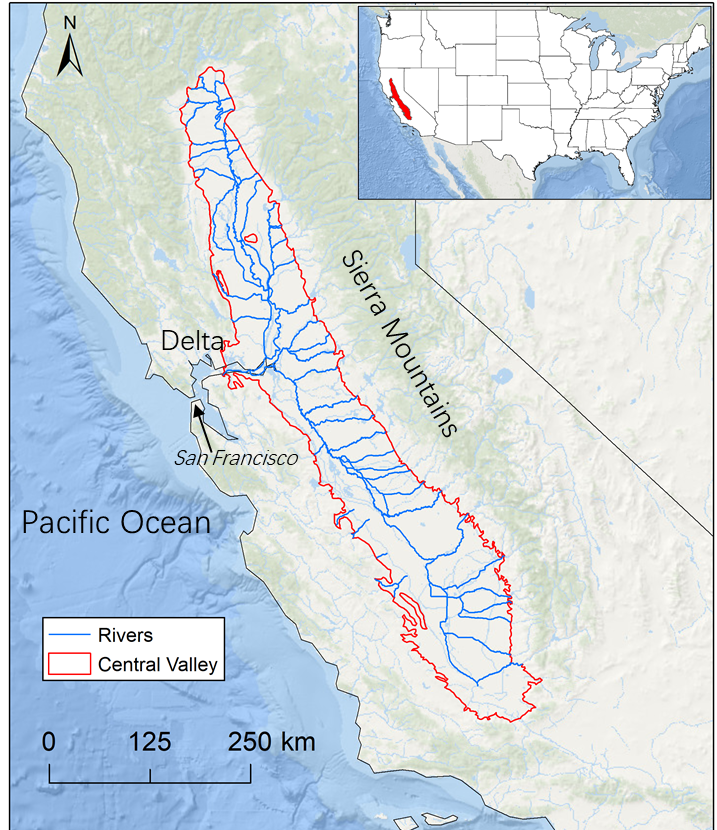

## Processing Codes accompanying the publication: 
### Alam, S., Gebremichael, M., Li, R., Dozier, J. and Lettenmaier, D.P., 2020. Can managed aquifer recharge mitigate the groundwater overdraft in California's central valley?. Water Resources Research, 56(8), p.e2020WR027244. https://doi.org/10.1029/2020WR027244

THE Codes IS PROVIDED "AS IS", WITHOUT WARRANTY OF ANY KIND, EXPRESS OR IMPLIED, INCLUDING BUT NOT LIMITED TO THE WARRANTIES OF MERCHANTABILITY, FITNESS FOR A PARTICULAR PURPOSE AND NONINFRINGEMENT. IN NO EVENT SHALL THE AUTHORS OR COPYRIGHT HOLDERS BE LIABLE FOR ANY CLAIM, DAMAGES OR OTHER LIABILITY, WHETHER IN AN ACTION OF CONTRACT, TORT OR OTHERWISE, ARISING FROM, OUT OF OR IN CONNECTION WITH THE SOFTWARE OR THE USE OR OTHER DEALINGS IN THE SOFTWARE.

* Author: Sarfaraz Alam (szalam@stanford.edu), Stanford Univ Dept of Geophysics 
* Date: 2/2022
* Description: This repository contains the codes for pre-processing and post-processing C2VSIM model files and simulated outputs.
* Additional info: The codes were written when the author was Graduate student in Civil & Environmental Engineering Department at UCLA 

  
Central Valley locations

## More information about data used or queried in this repository can be found in the manuscript text.

## Delta Outflow - DWR
[dayflow](https://water.ca.gov/Programs/Environmental-Services/Compliance-Monitoring-And-Assessment/Dayflow-Data)

## Reservoir Data - California Data Exchange Center
[http://cdec.water.ca.gov/misc/monthlyStations.html](http://cdec.water.ca.gov/misc/monthlyStations.html) 

## C2VSIM model - California Data Exchange Center
[C2VSIM](https://data.cnra.ca.gov/dataset/c2vsimfg_beta2)

## Soil Agricultural Groundwater Banking Index (SAGBI)
[SAGBI](https://casoilresource.lawr.ucdavis.edu/sagbi/)
